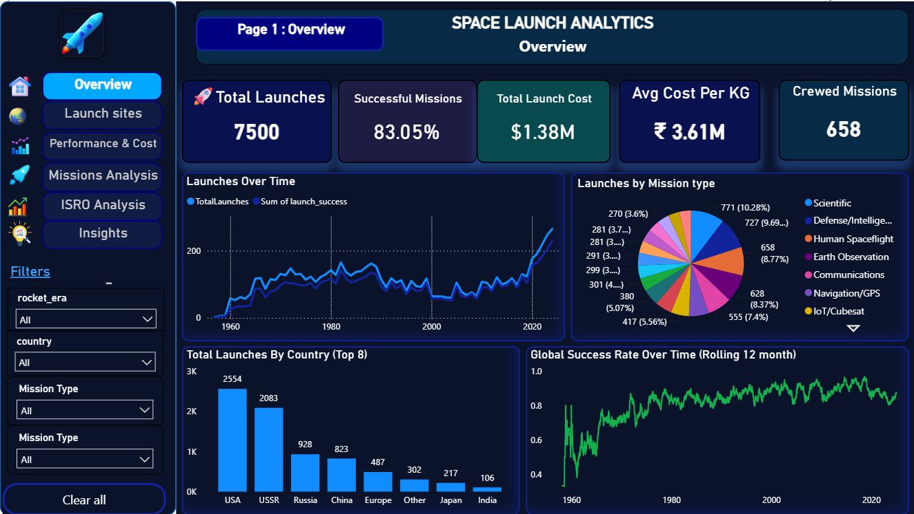

# 🚀 Space Launch Analytics



## 📌 Project Overview

This project is an end-to-end Data Analytics solution built to analyze global space launch operations, rocket performance, mission success rates, launch costs, payload efficiency, and orbital deployment trends.

The solution combines Python, SQL, MySQL, Pandas, NumPy, and Power BI to transform raw launch datasets into actionable business insights that support strategic decision-making for satellite operators and launch service providers.

The project demonstrates skills in:

* Data Cleaning & Preprocessing
* Exploratory Data Analysis (EDA)
* Feature Engineering
* SQL Analytics
* Data Quality Assessment
* Business KPI Development
* Trend Analysis
* Data Warehousing
* Dashboard Development
* Business Intelligence Reporting

---

# 🎯 Business Problem

Commercial satellite operators face several challenges:

* High launch costs
* Launch failures and mission risks
* Payload capacity optimization
* Rocket selection decisions
* Orbit deployment planning
* Fleet utilization management

The goal of this project is to identify:

* Which rockets provide the best reliability
* Which launch providers deliver the highest payload efficiency
* How launch costs impact mission success
* Long-term trends in launch activity
* Key business KPIs affecting mission outcomes

---

# 🏗️ Solution Architecture


Raw CSV Datasets
       │
       ▼
Python ETL Pipeline
       │
       ▼
Data Cleaning & Validation
       │
       ▼
Feature Engineering
       │
       ▼
MySQL Data Warehouse
       │
       ▼
SQL-Based Analytics
       │
       ▼
Pandas EDA
       │
       ▼
Power BI Dashboards
       │
       ▼
Business Insights


# 🛠️ Technology Stack

| Category               | Tools          |
| ---------------------- | -------------- |
| Programming            | Python         |
| Data Analysis          | Pandas, NumPy  |
| Database               | MySQL          |
| SQL Toolkit            | SQLAlchemy     |
| Environment Management | dotenv         |
| Visualization          | Power BI       |
| Reporting              | CSV Reports    |
| Logging                | Python Logging |

---

# 📂 Project Structure

```
Space-Launch-Analytics/
│
├── datasets/
│   ├── launches.csv
│   ├── rockets.csv
│   └── ISRO Satellite Dataset.csv
│
├── outputs/
│   ├── enhanced_launches.csv
│   ├── monthly_launches.csv
│   ├── yearly_launches.csv
│   ├── rolling_success_rate.csv
│   └── data_quality_report.csv
│
├── reports/
│   ├── dataset_overview.csv
│   ├── success_rate.csv
│   ├── rocket_performance.csv
│   ├── business_kpis.csv
│   └── ...
│
├── space_data_processor.py
├── eda_analyzer.py
├── .env
├── requirements.txt
└── README.md
```

---

# 🔄 Data Processing Pipeline

## Step 1 — Data Ingestion

The pipeline loads:

* Launch Dataset
* Rocket Dataset
* ISRO Satellite Dataset

using Pandas DataFrames.

---

## Step 2 — Data Quality Assessment

The following checks are performed:

* Missing Values
* Duplicate Records
* Invalid Payload Mass
* Invalid Launch Costs
* Schema Validation

Generated Report:

```
outputs/data_quality_report.csv
```

---

## Step 3 — Feature Engineering

Several business-focused metrics are created.

### Cost Per Kilogram

Measures launch cost efficiency.

```
Launch Cost / Payload Mass
```

### Payload Utilization %

Measures how efficiently rocket capacity is utilized.

```
Payload Mass / Rocket Capacity
```

### Mission Outcome

Classifies launches into:

* Success
* Partial Failure
* Failure

---

# 🗄️ Data Warehouse Design

The cleaned datasets are stored in MySQL.

### Tables

#### launches

Raw launch records

#### rockets

Rocket specifications

#### enhanced_launches

Business-ready analytical dataset

#### isro_orbit_mass_summary

ISRO orbital deployment summary

---

# 📊 Exploratory Data Analysis (EDA)

Both SQL and Pandas-based EDA are implemented.

## SQL-Based Analysis

### Dataset Overview

* Total Launches
* Unique Rockets

### Success Rate Analysis

* Success vs Failure %
* Mission Reliability

### Cost Efficiency Analysis

* Cost per Kilogram
* Rocket Cost Ranking

### Rocket Performance Analysis

* Average Payload
* Average Cost
* Success Rate

### Reliability Ranking

* Most Reliable Rockets

### Payload Analysis

* Small Payload Missions
* Medium Payload Missions
* Heavy Payload Missions

### Cost Analysis

* Low Cost Missions
* Medium Cost Missions
* High Cost Missions

### Outlier Detection

* Launch Cost Outliers

---

## Pandas-Based Analysis

The project also generates:

### Dataset Shape

```
df.shape
```

### Dataset Information

```
df.info()
```

### Descriptive Statistics

```
df.describe()
```

### Missing Value Analysis

```
df.isnull().sum()
```

### Correlation Analysis

```
df.corr()
```

---

# 📈 Trend Analysis

The pipeline generates time-series analytics.

### Monthly Launch Trend

```
outputs/monthly_launches.csv
```

### Yearly Launch Trend

```
outputs/yearly_launches.csv
```

### Rolling 12-Month Success Rate

```
outputs/rolling_success_rate.csv
```

---

# 📊 Power BI Dashboards

The following dashboards were designed.

## Dashboard 1 — Executive Overview

KPIs:

* Total Launches
* Success Rate
* Average Launch Cost
* Average Payload Mass

---

## Dashboard 2 — Rocket Performance

Visuals:

* Success Rate by Rocket
* Payload Capacity Analysis
* Cost Efficiency Ranking

---

## Dashboard 3 — Launch Trends

Visuals:

* Monthly Launch Trend
* Yearly Launch Trend
* Rolling Success Rate

---

## Dashboard 4 — Cost & Payload Analytics

Visuals:

* Payload vs Success Rate
* Cost vs Success Rate
* Cost Efficiency Comparison

---

## Dashboard 5 — ISRO Mission Analytics

Visuals:

* Orbit Distribution
* Launch Mass by Orbit
* Mission Deployment Analysis

---

# 📌 Key Business Insights

The project enables stakeholders to:

* Identify high-performing rockets
* Reduce mission risk
* Improve payload utilization
* Monitor launch success trends
* Compare launch cost efficiency
* Support strategic fleet planning
* Optimize satellite deployment decisions

---

# 🚀 How to Run

## Clone Repository

```bash
git clone https://github.com/Pranaw108/Space_Launch_Analysis.git
cd Space-Launch-Analytics
```

## Install Dependencies

```bash
pip install -r requirements.txt
```

## Configure Environment Variables

Create a `.env` file:

```env
DB_USER=root
DB_PASSWORD=your_password
DB_HOST=localhost
DB_NAME=space_analytics
```

## Execute Pipeline

```bash
python space_data_processor.py
```

## Run EDA Module

```bash
python eda_analyzer.py
```

---

# 💼 Skills Demonstrated

### Data Analytics

* Exploratory Data Analysis
* KPI Development
* Business Reporting
* Trend Analysis

### Python

* Pandas
* NumPy
* SQLAlchemy
* Logging
* OOP

### SQL

* Aggregations
* Window Functions
* Grouping
* Business Queries

### Business Intelligence

* Power BI
* Dashboard Design
* Executive Reporting

### Data Engineering

* ETL Pipeline
* Data Validation
* Feature Engineering
* Data Warehousing

---


# 👨‍💻 Author

Pranaw Gautam

Aspiring Data Analyst | SQL | Python | Power BI | Data Visualization | Business Intelligence

Open to opportunities in:

* Data Analytics
* Business Intelligence
* Reporting & Insights
* Data Engineering
* Analytics Consulting

---

⭐ If you found this project useful, consider giving it a star.
